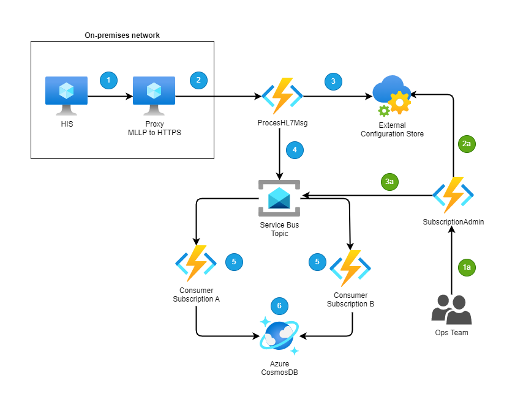

# Introduction

This GitHub repository show how to create routing in Azure Service Bus when receiving HL7 v2 messages.

This represent a HIS (Hospital Information System) sending HL7 v2 messages to an Azure Function.  In a real scenario, you will probably have a proxy between the HIS and the Azure Function.

Most of the HIS are still using MLLP (Minimal Lower Layer Protocol) to send HL7 v2 messages.  This protocol is not supported in Azure.  This is why we need to use a proxy.

The proxy will receive the HL7 v2 message from the HIS and send it to the Azure Function using HTTP.

In this scenario we will not simulate the proxy and just send message directly to an Azure Function.

Once the function receive the HL7 message it will read specific segments and fields from it.  Based on the [external configuration store pattern](https://learn.microsoft.com/en-us/azure/architecture/patterns/external-configuration-store)

# Architecture

The following diagram represent the architecture of this sample.  Keep in mind, we created a proxy to send the HL7 v2 message to the Azure Function.  In this sample we will not simulate the proxy and just send the message directly to the Azure Function.



##### HIS

1- The HIS send a HL7 v2 message to the Proxy (MLLP to HTTPS)
2- The Proxy send the HL7 v2 message to the Azure Function (HTTPS)
3- The Azure Function retrieve the routing configuration from Azure App Configuration
4- The Azure Function read the HL7 v2 message and extract the segments and fields needed to be added in the [message properties](https://learn.microsoft.com/en-us/rest/api/servicebus/message-headers-and-properties#message-properties).  Those properties will be used to route the message to the right topic subscription.  Once all user defined properties are added to the message, the Azure Function send the message to the Service Bus Topic.
5- In this scenario you have two consumers with their own subscription and filter.  Each receive the message that match their filter.
6 - Once the message retrieve it's saved to CosmosDB with the HL7 message and the message properties.

##### Ops Team

1a- The Ops Team can call the Subscription Admin Function to create new subscriptions and rules (filter) to it.
2a- The function retrieves the configuration related to subscription and rules from Azure App Configuration.
3a- The function create the subscription and rules in the Service Bus Topic.

## Azure App Configuration

The Azure Functions will retrieve the routing configuration from Azure App Configuration.  This is the [external configuration store pattern](https://learn.microsoft.com/en-us/azure/architecture/patterns/external-configuration-store), all specific fields that need to be added to message properties and subscriptions and filters are stored in Azure App Configuration.  No code changes is needed only configuration changes.

## HL7 v2 Message extraction

The routing is based on configuration stored in Azure App Configuration.  The goal is to create extraction of specific segments and fields from the HL7 v2 message and add them as properties in the message without doing any code changes.

Here you can find the default configuration used in this sample in the directory **bicep/modules/appconfiguration/hl7.extraction.json**

Here the default value of the configuration

```json
{
    "Routing": {
        "ArtifactName": "Contoso_HIS",
        "SessionField": {
            "SegmentName": "MSG",
            "Position": "3"
        },
        "HL7SegmentRoutings": [
            {
                "SegmentName": "MSH",
                "Position": 3
            },
            {
                "SegmentName": "MSH",
                "Position": 4
            },
            {
                "SegmentName": "MSH",
                "Position": 5
            },
            {
                "SegmentName": "MSH",
                "Position": 6
            },
            {
                "SegmentName": "MSH",
                "Position": 9,
                "SubPosition": [
                    1,
                    2
                ],
                "SubPositionSeparator": "^"
            }                  
        ],
        "Port": 12001
    }
}

## Subscription and rules

Same concept here apply than the HL7 message extraction, in the above step we extract all the HL7 segments and fields that will be needed to create rule (filter) in the topic subscription.

Here what look like the configuration

```json
{
    "Subscriptions":
        {
            "TopicName": "integration",
            "Subscriptions": [
                {
                    "Name": "ConsumerA",
                    "Rules": [{
                        "Name": "RuleA",
                        "Filter": "MSH.3 = 'CONTOSO_SENDER_A' AND MSH.5 = 'CONTOSO_RECEIVE_A' AND MSH.9.1 = 'ADT' AND MSH.9.2 = 'A01' OR MSH.3 = 'CONTOSO_SENDER_A' AND MSH.5 = 'CONTOSO_RECEIVE_A' AND MSH_9_1 = 'ADT' AND MSH.9.2 = 'A02' OR MSH.3 = 'CONTOSO_SENDER_A' AND MSH.5 = 'CONTOSO_RECEIVE_A' AND MSH.9.1 = 'ADT' AND MSH.9.2 = 'A01' OR MSH.3 = 'CONTOSO_SENDER_A' AND MSH.5 = 'CONTOSO_RECEIVE_A' AND MSH.9.1 = 'ADT' AND MSH.9.2 = 'A04'",
                        "IsActive": true,
                        "Recreate": true
                    }]
                },
                {
                    "Name": "ConsumerB",
                    "Rules": [{
                        "Name": "RuleA",
                        "Filter": "MSH.3 = 'CONTOSO_SENDER_B' AND MSH.5 = 'CONTOSO_RECEIVE_B' AND MSH.9.1 = 'ADT' AND MSH.9.2 = 'A04'",
                        "IsActive": true,
                        "Recreate": true
                    }]                    
                }
            ]
        }
    
}
```

Here you have the name of the topic and the list of subscriptions.  Each subscription has a rule name and all the needed rules (filter) based on specific segments and fields from the HL7 v2 message.

The IsActive can be used to deactivate the subscription in case of maintenance or other reason.  If you deactivate a subscription keep in mind of the [restrictions ](https://learn.microsoft.com/en-us/azure/service-bus-messaging/entity-suspend).  

The recreate can be used to delete and create again the subscription and the rules.  Doing so will remove all the messages in the subscription.  This is useful when you want to change the rules (filter) and you want to remove all the messages that don't match the new rules.

# Prerequisites

- Fork this GitHub repository
- Create Service Principal needed for [GitHub Actions](https://github.com/marketplace/actions/azure-login#configure-a-service-principal-with-a-secret)
- Create GitHub Secrets

| Name | Value |
| ---- | ----- |
| AZURE_CREDENTIALS | Service Principal created above |
| AZURE_SUBSCRIPTION | Azure Subscription Id |
| PA_TOKEN | Personal Access Token ([PAT](https://github.com/marketplace/actions/create-github-secret-action#pa_token)) to access the GitHub repository |

# Create Azure Resources

Now, is time to create the Azure Resources, to do so just run the GitHub Actions called **Create Azure Resources**.

# Deploy functions

Now, you can deploy the 3 functions created in this sample.  You just need to execute those 3 GitHub Actions.

- Deploy Admin Azure Function
- Deploy Consumers Azure Function
- Deploy ProcessHL7Msg Azure Function

## Function Endpoints

Here the specific endpoints for All Azure Function

| Function | Endpoint | Purpose |
| -------- | -------- | --------| 
| fnc-admin-{uniqueid}    | https://{function-app-name}.azurewebsites.net/api/ManageSubscription?code={function-key} | Create all subscriptions and rules (filter) |
| fnc-admin-{uniqueid} | https://{function-app-name}.azurewebsites.net/api/RecreateTopic?code={function-key} | Recreate the topic, keep in mind this action will delete all existing messages |
| fnc-admin-{uniqueid} | https://{function-app-name}.azurewebsites.net/api/GetConfiguration?code={function-key} | Get the subscription configuration |
| fnc-routing-{uniqueid} | https://{function-app-name}.azurewebsites.net/api/ProcessHL7Msg?code={function-key} | Process HL7 msg and save it in the bus |
| fnc-routing-{uniqueid} | https://{function-app-name}.azurewebsites.net/api/GetHl7Configuration?code={function-key} | Get the HL7 segments fields configuration |