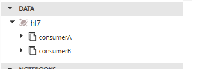
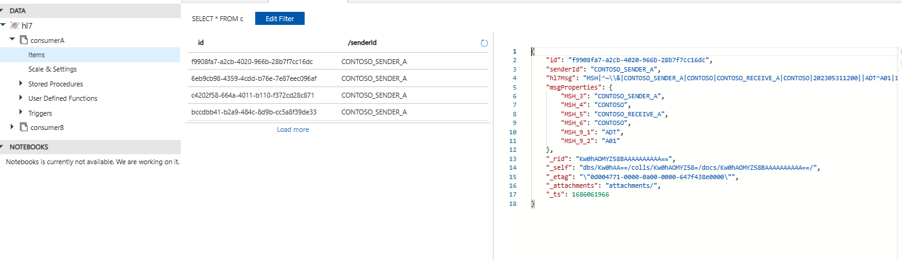
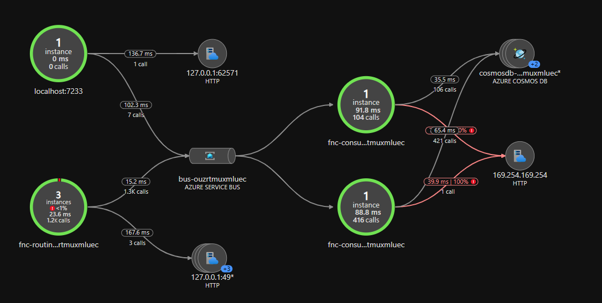
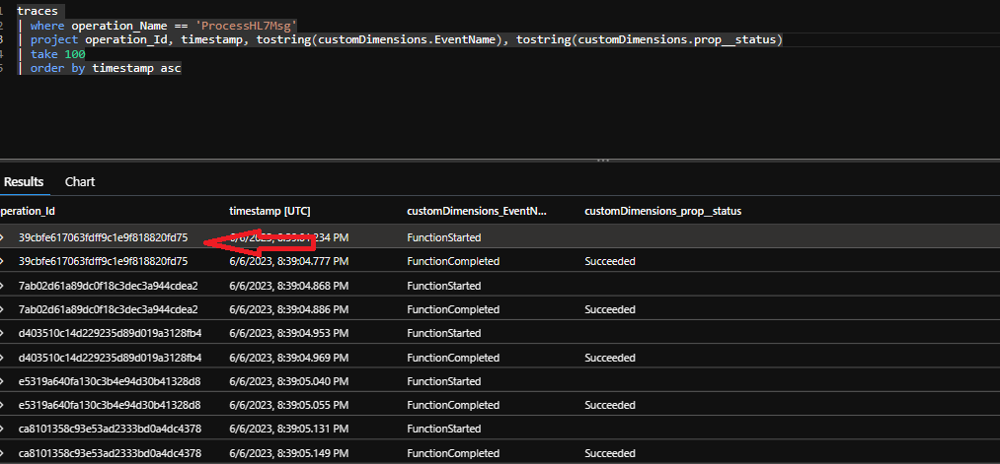
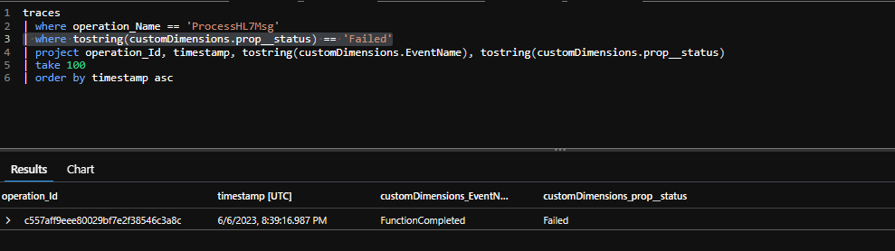
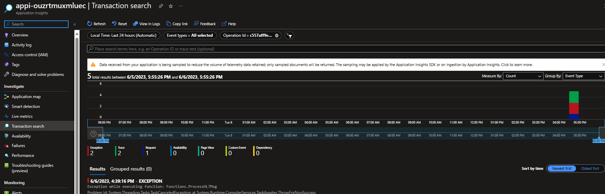
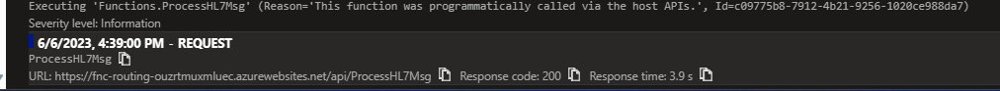
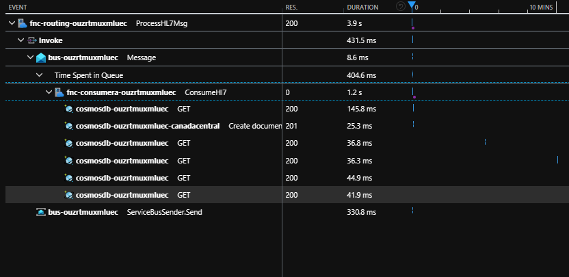

# Table of Contents
- [Introduction](#introduction)
- [Architecture](#architecture)
  - [HIS](#his)
  - [Ops Team](#ops-team)
  - [Azure App Configuration](#azure-app-configuration)
  - [HL7 v2 Message extraction](#hl7-v2-message-extraction)
  - [Subscriptions and rules](#subscriptions-and-rules)
- [Prerequisites](#prerequisites)
- [Create the Azure Resources](#create-the-azure-resources)
- [Deploy the Azure Function](#deploy-the-azure-function)
  - [Function Endpoints](#function-endpoints)
- [Configure the Hl7Sender console application](#configure-the-hl7sender-console-application)
- [Application Insights](#application-insight)

# Introduction

This GitHub repository show how to create routing in Azure Service Bus when receiving HL7 v2 messages.

This sample represents a HIS (Hospital Information System) sending HL7 v2 messages to an Azure Function.  In a real scenario, you will probably have a proxy between the HIS and the Azure Function.

Most of the HIS are still using MLLP (Minimal Lower Layer Protocol) to send HL7 v2 messages.  This protocol is not supported in natively in Azure. You can have workaround to achieve it like creating your own TCP listener and host it in a container.  The best approach is still to have a proxy on premise.

The proxy will receive the HL7 v2 message from the HIS and send it to the Azure Function using HTTP.

In this scenario we will not simulate the proxy and just send messages directly to an Azure Function using a simple C# console application.

Once the function receives the HL7 message, it will read specific segments and fields from it.  To retrieve which fields need to be extracted we are using the [external configuration store pattern](https://learn.microsoft.com/en-us/azure/architecture/patterns/external-configuration-store)

# Architecture

The following diagram represents the architecture.  The HIS and proxy in our sample will be replaced with a console application but the same concept will apply in a real production scenario.


##### HIS

1- The HIS send an HL7 v2 message to the Proxy (MLLP to HTTPS)
2- The Proxy sends the HL7 v2 message to the Azure Function (HTTPS)
3- The Azure Function retrieve the routing configuration from Azure App Configuration
4- The Azure Function read the HL7 v2 message and extract the segments and fields needed to be added in the [message properties](https://learn.microsoft.com/en-us/rest/api/servicebus/message-headers-and-properties#message-properties).  Those properties will be used to route the message to the right topic subscription.  Once all user defined properties are added to the message, the Azure Function sends the message to the Service Bus Topic.
5- In this scenario you have two consumers with their own subscription and filter.  Each receives the message that matches their filter.
6 - Once the message retrieve it's saved to CosmosDB with the HL7 message and the message properties.

##### Ops Team

1a- The Ops Team can call the Subscription Admin Function to create new subscriptions and rules (filter) to it.
2a- The function retrieves the configuration related to subscription and rules from Azure App Configuration.
3a- The function create the subscription and rules in the Service Bus Topic.

## Azure App Configuration

The Azure Functions will retrieve the routing configuration from Azure App Configuration.  This is the [external configuration store pattern](https://learn.microsoft.com/en-us/azure/architecture/patterns/external-configuration-store), all specific fields that need to be added to message properties and subscriptions and filters are stored in Azure App Configuration.  No code changes its needed only configuration changes.

## HL7 v2 Message extraction

The routing is based on configuration stored in Azure App Configuration.  The goal is to create extraction of specific segments and fields from the HL7 v2 message and add them as properties in the message without doing any code changes.

Here you can find the default configuration used in this sample in the directory **bicep/modules/appconfiguration/hl7.extraction.json**

Here the default value of the configuration, for this sample only the HL7SegmentRoutings is considered.  You can modify the sample to fit more your needs.

```json
{
    "Routing": {
        "ArtifactName": "Contoso_HIS",
        "SessionField": {
            "SegmentName": "MSG",
            "Position": "3"
        },
        "HL7SegmentRoutings": [
            {
                "SegmentName": "MSH",
                "Position": 3
            },
            {
                "SegmentName": "MSH",
                "Position": 4
            },
            {
                "SegmentName": "MSH",
                "Position": 5
            },
            {
                "SegmentName": "MSH",
                "Position": 6
            },
            {
                "SegmentName": "MSH",
                "Position": 9,
                "SubPosition": [
                    1,
                    2
                ],
                "SubPositionSeparator": "^"
            }                  
        ],
        "Port": 12001
    }
}
```
## Subscriptions and rules

Same concept here apply than the HL7 message extraction, in the above step we extract all the HL7 segments and fields that will be needed to create rule (filter) in the topic subscription.

Here what look like the configuration

```json
{
    "Subscriptions":
        {
            "TopicName": "integration",
            "Subscriptions": [
                {
                    "Name": "ConsumerA",
                    "Rules": [{
                        "Name": "RuleA",
                        "Filter": "MSH.3 = 'CONTOSO_SENDER_A' AND MSH.5 = 'CONTOSO_RECEIVE_A' AND MSH.9.1 = 'ADT' AND MSH.9.2 = 'A01' OR MSH.3 = 'CONTOSO_SENDER_A' AND MSH.5 = 'CONTOSO_RECEIVE_A' AND MSH_9_1 = 'ADT' AND MSH.9.2 = 'A02' OR MSH.3 = 'CONTOSO_SENDER_A' AND MSH.5 = 'CONTOSO_RECEIVE_A' AND MSH.9.1 = 'ADT' AND MSH.9.2 = 'A01' OR MSH.3 = 'CONTOSO_SENDER_A' AND MSH.5 = 'CONTOSO_RECEIVE_A' AND MSH.9.1 = 'ADT' AND MSH.9.2 = 'A04'",
                        "IsActive": true,
                        "Recreate": true
                    }]
                },
                {
                    "Name": "ConsumerB",
                    "Rules": [{
                        "Name": "RuleA",
                        "Filter": "MSH.3 = 'CONTOSO_SENDER_B' AND MSH.5 = 'CONTOSO_RECEIVE_B' AND MSH.9.1 = 'ADT' AND MSH.9.2 = 'A04'",
                        "IsActive": true,
                        "Recreate": true
                    }]                    
                }
            ]
        }
    
}
```

Here you have the name of the topic and the list of subscriptions.  Each subscription has a rule name and all the needed rules (filter) based on specific segments and fields from the HL7 v2 message.

The IsActive can be used to deactivate the subscription in case of maintenance or other reason.  If you deactivate a subscription keep in mind of the [restrictions ](https://learn.microsoft.com/en-us/azure/service-bus-messaging/entity-suspend).  **Note** that the IsActive is not used in the code right now in this **sample**.

The recreate can be used to delete and create again the subscription and the rules.  Doing so will remove all the messages in the subscription.  This is useful when you want to change the rules (filter) and you want to remove all the messages that don't match the new rules.

# Prerequisites

- Fork this GitHub repository
- Create Service Principal needed for [GitHub Actions](https://github.com/marketplace/actions/azure-login#configure-a-service-principal-with-a-secret)
- Create GitHub Secrets

| Name | Value |
| ---- | ----- |
| AZURE_CREDENTIALS | Service Principal created above |
| AZURE_SUBSCRIPTION | Azure Subscription Id |
| PA_TOKEN | Personal Access Token ([PAT](https://github.com/marketplace/actions/create-github-secret-action#pa_token)) to access the GitHub repository |

# Create Azure Resources

Now, it is time to create the Azure Resources, to do so just run the GitHub Actions called **Create Azure Resources**.

# Deploy functions

Now, you can deploy the 3 functions created in this sample.  You just need to execute those 3 GitHub Actions.

- Deploy Admin Azure Function
- Deploy Consumers Azure Function
- Deploy ProcessHL7Msg Azure Function

## Function Endpoints

Here the specific endpoints for All Azure Function

| Function | Endpoint | Purpose |
| -------- | -------- | --------| 
| fnc-admin-{uniqueid}    | https://{function-app-name}.azurewebsites.net/api/ManageSubscription?code={function-key} | Create all subscriptions and rules (filter) |
| fnc-admin-{uniqueid} | https://{function-app-name}.azurewebsites.net/api/RecreateTopic?code={function-key} | Recreate the topic, keep in mind this action will delete all existing messages |
| fnc-admin-{uniqueid} | https://{function-app-name}.azurewebsites.net/api/GetConfiguration?code={function-key} | Get the subscription configuration |
| fnc-routing-{uniqueid} | https://{function-app-name}.azurewebsites.net/api/ProcessHL7Msg?code={function-key} | Process HL7 msg and save it in the bus |
| fnc-routing-{uniqueid} | https://{function-app-name}.azurewebsites.net/api/GetHl7Configuration?code={function-key} | Get the HL7 segments fields configuration |
| fnc-consumerA-{uniqueid} | N/A Service Bus Topic Trigger | Get the message in the subscription ConsumerA |
| fnc-consumerB-{uniqueid} | N/A Service Bus Topic Trigger | Get the message in the subscription ConsumerB |

# Configure the Hl7Sender console application

Since this it's a simulation and we don't receive HL7 message from a proxy, we need to simulate the sender.  To do so, we use a console application that will send HL7 message to the Azure Function.

Open HL7Sender in Visual Studio and open the **appsettings.json** file.  Here you need to update the following values

| Name | Value |
| ---- | ----- |
| SendApiUrl | https://fnc-routing-{uniqueid}.azurewebsites.net/api/ProcessHL7Msg?code={function-key} |
| TopicApiUrl | https://fnc-admin-{uniqueid}.azurewebsites.net/api/RecreateTopic?code={function-key} |
| SubsApiUrl | https://fnc-admin-{uniqueid}.azurewebsites.net/api/ManageSubscription?code={function-key} |

To retrieve the function URL go to the [Azure Portal](www.portal.azure.com) in the resource group called **rg-srvbus-routing**.  In this resource group you will find the 3 functions created in this sample.  Open each function and go to the **Functions** section.  Here you will find the URL and the function key in the top menu.


Now, you can run the console application and you will see the following output.


Enter the option **3** and press enter.

Now, go to the **Azure Portal** and click on the Azure Service Bus and in the left menu click on **Topics**.  

You will see one topic called **integration** and click on it.  In the left menu click on **Subscriptions**.

You will see two subscriptions called **ConsumerA** and **ConsumerB**.  


Click on **ConsumerA** and at the bottom you will see a filter called **RuleA** and click on it.


```sql
MSH_3 = 'CONTOSO_SENDER_A'  AND 
MSH_5 = 'CONTOSO_RECEIVE_A' AND 
MSH_9_1 = 'ADT'             AND 
MSH_9_2 = 'A01' 
OR 
MSH_3 = 'CONTOSO_SENDER_A'  AND 
MSH_5 = 'CONTOSO_RECEIVE_A' AND 
MSH_9_1 = 'ADT'             AND 
MSH_9_2 = 'A02' 
OR 
MSH_3 = 'CONTOSO_SENDER_A'  AND 
MSH_5 = 'CONTOSO_RECEIVE_A' AND 
MSH_9_1 = 'ADT'             AND 
MSH_9_2 = 'A03' 
OR 
MSH_3 = 'CONTOSO_SENDER_A'  AND 
MSH_5 = 'CONTOSO_RECEIVE_A' AND 
MSH_9_1 = 'ADT'             AND 
MSH_9_2 = 'A04'
```
Here you can see you can create complex filtering, in this case the subscription called ConsumerA will accept only ADT msg 01 to 04.

Now to do the same to see the filter for the **ConsumerB**

```sql
MSH_3 = 'CONTOSO_SENDER_B'  AND 
MSH_5 = 'CONTOSO_RECEIVE_B' AND 
MSH_9_1 = 'ADT'             AND 
MSH_9_2 = 'A04'
```

The consumerB will accept only ADT msg 04.

**KEEP IN MIND** the message generated are only for demo purpose and doesn't represent real HL7 message.  The filter can seem off but the goal here it's only to show the concept of routing with Azure Service Bus and subscription.

### Send message to the Azure function

Now we can send messages to the Azure Function, it will process them and save them in the Azure Service Bus Topic.

The console application will send 12 messages to the Azure Function.

Based on the current filter 4 will match the consumerA subscription and only 1 for the consumerB subscription.

Here the list of messages with custom properties so you can understand the routing done at the subscription level.


### Validate the consumers function are working

After a couple of seconds, all message in the topics should be processed by the consumer functions.

Go to the CosmosDB created in this GitHub repository and click in the **Data Explorer**.

You should see two collections below the HL7 database.



Open the first one called consumerA, you should see 4 documents there.



Do the same for the collection called consumerB, you should see 1 document there.

# Application Insight

In this sample, all functions are using Application Insight, this allows us to get monitoring end-to-end.  One of the nice features
with application insight it's the application map.



Now, sometimes you want to get all the end-to-end tracing of a particular operation.

First thing to do is to go to your Application Insights instance and in the left menu click on **Logs**.

Run this following query as an example.

```sql
traces 
| where operation_Name == 'ProcessHL7Msg'
| project operation_Id, timestamp, tostring(customDimensions.EventName), tostring(customDimensions.prop__status)
| take 100
| order by timestamp asc
```

This will return the last 100 traces for the function called **ProcessHL7Msg**.



From there you can see when a function started and when it completed and if it failed or not.  The operation_id is the same for one execution.

Now, if you want to find function that failed you can run this query.

```sql
traces 
| where operation_Name == 'ProcessHL7Msg'
| where tostring(customDimensions.prop__status) == 'Failed'
| project operation_Id, timestamp, tostring(customDimensions.EventName), tostring(customDimensions.prop__status)
| take 100
| order by timestamp asc
```



Take note of the operation_id, now you want to find the end-to-end trace.

Now goes in the menu Transaction search and with the filter at the top select the **Operation Id** field and paste the operation_id from the previous Kusto query.



You will see the exception at the bottom, you can now click on it and see the exception details.

Now if you want to see a transaction end to end with the time of execution between all of them, you can run this Kusto query.

```sql
traces 
| where operation_Name == 'ProcessHL7Msg'
| where tostring(customDimensions.prop__status) != 'Failed'
| project operation_Id, timestamp, tostring(customDimensions.EventName), tostring(customDimensions.prop__status)
| take 100
| order by timestamp asc
```

Copy the value of the operation_id for one of the transactions and go back to the Transaction search and paste the value in the filter.

Click on the REQUEST details for the ProcessHL7Msg function call.  This is where the transaction begins.



Click on the details and you will see the end-to-end transaction with the total duration end to end and for each operation.



